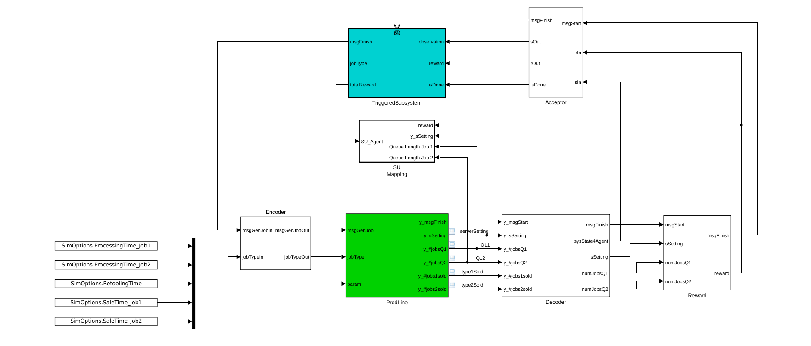

# MATLAB-RL-Agent_with_SimEvents

## Overview
This is an example of using the Q-Agent from the MATLAB Reinforcement Learning Toolbox with a discrete-event-based SimEvents model. It shows a procedure that makes it possible to use the agent in an event-driven manner. It can also be transferred to other agents in the toolbox.

The Simulink model is structured using the concept of Experimental Frame. Please refer to the following publications:

* Pawletta, T., Bartelt, J. (2023). Integration of Reinforcement Learning and Discrete Event Simulation Using the Concept of Experimental Frame. Eurosim Congress 2023, Amsterdam, Netherlands, July 3-5, PostConf pub. In: SNE Simulation Notes Europe, 33(3):101-109, DOI: 10.11128/sne.33.tn.10651. 
([full-text on ResearchGate](https://www.researchgate.net/publication/372059172_Integration_of_Reinforcement_Learning_and_Discrete_Event_Simulation_Using_the_Concept_of_Experimental_Frame))

* Pawletta, T., Bartelt, J. (2023). Integrating Reinforcement Learning and Discrete Event Simulation Using the Concept of Experimental Frame: A Case Study with MATLAB/SimEvents. ASIM STS/GMMS & EDU Workshop'23, Magdeburg, Germany, March 6-7, 133-140. DOI 10.11128/arep.21, ASIM Mitteilung 185.
([full-text on ResearchGate](https://www.researchgate.net/publication/369282875_Integrating_Reinforcement_Learning_and_Discrete_Event_Simulation_Using_the_Concept_of_Experimental_Frame_A_Case_Study_With_MATLABSimEvents))

